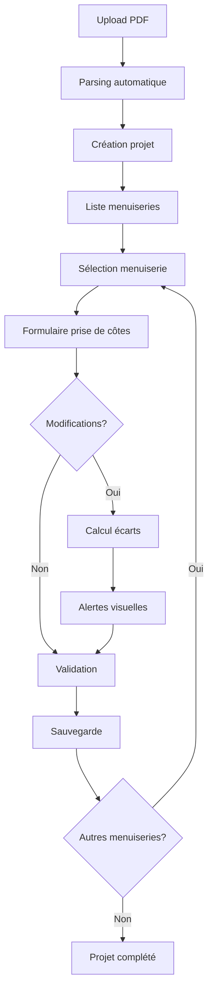

# CONTEXT.md - Application ProMétrage

## Document de contexte principal pour Claude Code

### 📋 Résumé du projet

Application web mobile-first permettant aux artisans de faire des prises de côtes sur chantier. L'application parse automatiquement des fiches métreur PDF pour extraire les données des menuiseries, puis permet de valider/modifier ces valeurs sur site avec alertes visuelles pour les écarts.

### 🏗️ Architecture technique

```typescript
// Stack obligatoire
const stack = {
  framework: "Next.js 15+ (App Router)",
  ui: "Shadcn/ui + Tailwind CSS",
  state: "TanStack Query + Zustand",
  forms: "React Hook Form + Zod",
  pdf: "Anthropic Claude Sonnet 4.5 (Vision API)",
  db: "PostgreSQL + Prisma",
  hosting: "Vercel",
};
```

### 📊 Schéma de la base de données

```prisma
datasource db {
  provider = "postgresql"
  url      = env("DATABASE_URL")
}

generator client {
  provider = "prisma-client-js"
}

model Projet {
  id          String      @id @default(cuid())
  reference   String      @unique
  client      Json        // {nom, adresse, tel, email}
  pdfUrl      String
  dateUpload  DateTime    @default(now())
  statut      Status      @default(EN_COURS)
  menuiseries Menuiserie[]
  createdAt   DateTime    @default(now())
  updatedAt   DateTime    @updatedAt
}

model Menuiserie {
  id                String    @id @default(cuid())
  projetId          String
  projet            Projet    @relation(fields: [projetId], references: [id], onDelete: Cascade)

  // Identification
  repere            String?   // Ex: "Salon"
  intitule          String    // Ex: "Coulissant 2 vantaux"

  // Données JSON flexibles
  donneesOriginales Json      // Valeurs extraites du PDF
  donneesModifiees  Json?     // Modifications de l'artisan
  ecarts            Json?     // Analyse des différences

  validee           Boolean   @default(false)
  dateValidation    DateTime?

  createdAt         DateTime  @default(now())
  updatedAt         DateTime  @updatedAt

  @@index([projetId])
}

enum Status {
  EN_COURS
  VALIDE
  ARCHIVE
}
```

### 🔄 Workflow utilisateur détaillé



### 📝 Données à extraire du PDF

```typescript
interface DonneesMenuiserie {
  // Identification
  repere?: string; // Détection pattern "Mot : "
  intitule: string; // Titre en gras

  // Dimensions (obligatoires)
  largeur: number; // En mm
  hauteur: number; // En mm
  hauteurAllege?: number; // Optionnel

  // Caractéristiques principales
  gamme: "OPTIMAX" | "PERFORMAX" | "INNOVAX";
  couleurInt: string; // RAL ou description
  couleurExt: string; // Idem ou différente

  // Pose et installation
  pose: "tunnel" | "applique" | "renovation";
  dimensions: "clair de bois" | "execution";
  dormant: string; // "avec aile" | "sans aile"

  // Habillages
  habillageInt?: string; // Description ou "sans"
  habillageExt?: string; // Description ou "sans"

  // Vitrage
  doubleVitrage: string; // Ex: "44.2.16w Argon.4 PTR+"
  intercalaire: "blanc" | "noir";

  // Options coulissant
  ouvrantPrincipal?: "droite" | "gauche";
  fermeture?: string;
  poignee?: string;
  rails?: "inox" | "alu";

  // Couleurs complémentaires
  couleurJoints?: string;
  couleurQuincaillerie?: string;
  couleurPareTempete?: string;
  couleurPetitsBois?: string;
}
```

### 🎯 Parsing PDF via IA

```typescript
// Prompt structuré pour extraction via Claude Vision
const EXTRACTION_PROMPT = `
Tu es un expert en extraction de données de fiches métreur.

Analyse ce PDF et extrais TOUTES les menuiseries au format JSON strict.
Pour chaque menuiserie, extrais :

{
  "menuiseries": [
    {
      "repere": "Salon" | null,
      "intitule": "Coulissant 2 vantaux",
      "largeur": 3000,  // En mm (nombre)
      "hauteur": 2250,  // En mm (nombre)
      "gamme": "OPTIMAX" | "PERFORMAX" | "INNOVAX",
      "pose": "tunnel" | "applique" | "renovation",
      "dormant": "avec aile" | "sans aile",
      "intercalaire": "blanc" | "noir",
      ...
    }
  ],
  "metadata": {
    "confidence": 0.95,
    "warnings": ["..."],
    "clientInfo": { "nom": "...", ... }
  }
}

RÈGLES STRICTES:
1. Dimensions en nombres (millimètres)
2. Si illisible → null + warning
3. Gammes en MAJUSCULES
4. Poses en minuscules
`;

// Workflow parsing IA
async function parsePDFWithAI(pdfFile: File): Promise<ParsedData> {
  // 1. Convertir PDF en base64
  const pdfBase64 = await fileToBase64(pdfFile);

  // 2. Appel API Anthropic avec retry
  const response = await anthropic.messages.create({
    model: "claude-sonnet-4-5-20250514",
    max_tokens: 4096,
    messages: [{
      role: "user",
      content: [
        { type: "document", source: { type: "base64", media_type: "application/pdf", data: pdfBase64 } },
        { type: "text", text: EXTRACTION_PROMPT }
      ]
    }]
  });

  // 3. Validation Zod stricte
  const data = JSON.parse(response.content[0].text);
  const validated = menuiseriesResponseSchema.parse(data);

  // 4. Vérifier confiance
  if (validated.metadata.confidence < 0.7) {
    throw new Error("AI_LOW_CONFIDENCE - Vérification manuelle requise");
  }

  return validated;
}
```

### 🚨 Système d'alertes écarts

```typescript
enum NiveauAlerte {
  INFO = "info", // Écart < 5%
  WARNING = "warning", // Écart 5-10%
  ERROR = "error", // Écart > 10%
}

interface Ecart {
  champ: string;
  valeurOriginale: any;
  valeurModifiee: any;
  pourcentage?: number; // Pour valeurs numériques
  niveau: NiveauAlerte;
}

// Calcul pour dimensions
function calculateEcart(original: number, nouveau: number): Ecart {
  const difference = Math.abs(original - nouveau);
  const pourcentage = (difference / original) * 100;

  let niveau: NiveauAlerte;
  if (pourcentage > 10) niveau = NiveauAlerte.ERROR;
  else if (pourcentage > 5) niveau = NiveauAlerte.WARNING;
  else niveau = NiveauAlerte.INFO;

  return {
    champ: "dimension",
    valeurOriginale: original,
    valeurModifiee: nouveau,
    pourcentage,
    niveau,
  };
}
```

### 📱 Composants Mobile-First

```tsx
// Structure page mobile type
export default function MenuiseriePage({ params }: { params: { id: string } }) {
  return (
    <div className="min-h-screen bg-gray-50">
      {/* Header fixe */}
      <header className="sticky top-0 z-50 bg-white border-b">
        <div className="flex items-center justify-between p-4">
          <Button variant="ghost" size="icon">
            <ChevronLeft className="h-6 w-6" />
          </Button>
          <h1 className="text-lg font-semibold">Prise de côtes</h1>
          <Badge>{menuiserie.repere}</Badge>
        </div>
      </header>

      {/* Contenu scrollable */}
      <main className="pb-20">
        {" "}
        {/* Padding pour bouton fixe */}
        <Form {...form}>
          <div className="space-y-4 p-4">
            {/* Inputs adaptés mobile */}
            <FormField
              name="largeur"
              render={({ field }) => (
                <FormItem>
                  <FormLabel className="text-base">Largeur (mm)</FormLabel>
                  <FormControl>
                    <Input
                      {...field}
                      type="number"
                      inputMode="numeric"
                      className="h-14 text-lg font-medium"
                      placeholder="3000"
                    />
                  </FormControl>
                  {/* Alerte écart si différent */}
                  {ecart && <EcartAlert ecart={ecart} />}
                </FormItem>
              )}
            />
          </div>
        </Form>
      </main>

      {/* Bouton save fixe */}
      <footer className="fixed bottom-0 left-0 right-0 bg-white border-t p-4">
        <Button className="w-full h-14 text-lg" onClick={handleSave}>
          Enregistrer
        </Button>
      </footer>
    </div>
  );
}
```

### 🔧 Hooks personnalisés

```typescript
// Hook pour auto-save
export function useAutoSave(
  data: any,
  saveFn: (data: any) => Promise<void>,
  delay: number = 3000
) {
  const [isSaving, setIsSaving] = useState(false);

  useEffect(() => {
    const timer = setTimeout(async () => {
      setIsSaving(true);
      await saveFn(data);
      setIsSaving(false);
    }, delay);

    return () => clearTimeout(timer);
  }, [data, saveFn, delay]);

  return { isSaving };
}

// Hook pour navigation menuiseries
export function useMenuiserieNavigation(projetId: string) {
  const { data: menuiseries } = useQuery({
    queryKey: ["menuiseries", projetId],
    queryFn: () => fetchMenuiseries(projetId),
  });

  const [currentIndex, setCurrentIndex] = useState(0);

  const next = () => {
    if (currentIndex < menuiseries.length - 1) {
      setCurrentIndex((i) => i + 1);
    }
  };

  const previous = () => {
    if (currentIndex > 0) {
      setCurrentIndex((i) => i - 1);
    }
  };

  return {
    current: menuiseries?.[currentIndex],
    hasNext: currentIndex < (menuiseries?.length ?? 0) - 1,
    hasPrevious: currentIndex > 0,
    next,
    previous,
    progress: `${currentIndex + 1}/${menuiseries?.length ?? 0}`,
  };
}
```

### 🎨 Design System

```typescript
// Couleurs alertes
export const ALERT_COLORS = {
  info: {
    bg: "bg-blue-50",
    border: "border-blue-500",
    text: "text-blue-900",
    icon: "text-blue-500",
  },
  warning: {
    bg: "bg-orange-50",
    border: "border-orange-500",
    text: "text-orange-900",
    icon: "text-orange-500",
  },
  error: {
    bg: "bg-red-50",
    border: "border-red-500",
    text: "text-red-900",
    icon: "text-red-500",
  },
};

// Tailles minimales mobile
export const MOBILE_SIZES = {
  touchTarget: 44, // px - Apple HIG
  buttonHeight: 56, // px - Material Design
  inputHeight: 56, // px
  fontSize: 16, // px - Évite le zoom iOS
  padding: 16, // px
};
```

### 🚀 API Routes

```typescript
// app/api/upload/pdf/route.ts
export async function POST(request: Request) {
  const formData = await request.formData();
  const file = formData.get("file") as File;

  // 1. Upload fichier
  const fileUrl = await uploadFile(file);

  // 2. Parser PDF
  const menuiseries = await parsePDF(file);

  // 3. Créer projet
  const projet = await prisma.projet.create({
    data: {
      reference: generateReference(),
      client: extractClient(file.name),
      pdfUrl: fileUrl,
      menuiseries: {
        create: menuiseries.map((m) => ({
          repere: m.repere,
          intitule: m.intitule,
          donneesOriginales: m,
        })),
      },
    },
    include: {
      menuiseries: true,
    },
  });

  return NextResponse.json(projet);
}

// app/api/menuiseries/[id]/route.ts
export async function PUT(
  request: Request,
  { params }: { params: { id: string } }
) {
  const data = await request.json();
  const validated = menuiserieSchema.parse(data);

  // Récupérer l'original
  const original = await prisma.menuiserie.findUnique({
    where: { id: params.id },
  });

  // Calculer les écarts
  const ecarts = calculateAllEcarts(original.donneesOriginales, validated);

  // Mettre à jour
  const updated = await prisma.menuiserie.update({
    where: { id: params.id },
    data: {
      donneesModifiees: validated,
      ecarts: ecarts,
      validee: ecarts.length === 0,
    },
  });

  return NextResponse.json(updated);
}
```

### ⚠️ Points d'attention critiques

1. **Mobile First OBLIGATOIRE** - Toujours commencer par mobile
2. **TDD Strict** - Test avant code, sans exception
3. **Validation Zod** - Sur toutes les entrées utilisateur
4. **JSON Flexible** - Pour évolutions futures des catalogues
5. **Écarts Visuels** - Alertes claires avec couleurs
6. **Auto-save** - Pas de perte de données sur chantier
7. **Gros Boutons** - Minimum 44px pour usage avec gants

### 📚 Ressources clés

- [Next.js App Router](https://nextjs.org/docs/app)
- [Shadcn/ui](https://ui.shadcn.com)
- [TanStack Query](https://tanstack.com/query)
- [React Hook Form](https://react-hook-form.com)
- [Prisma](https://www.prisma.io)
